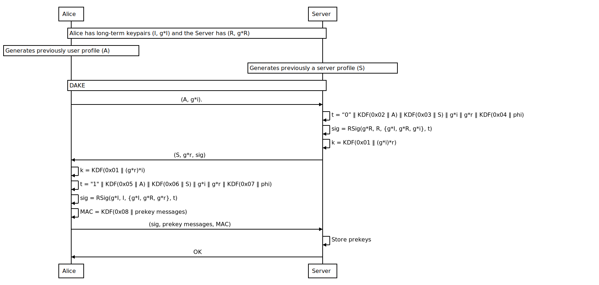
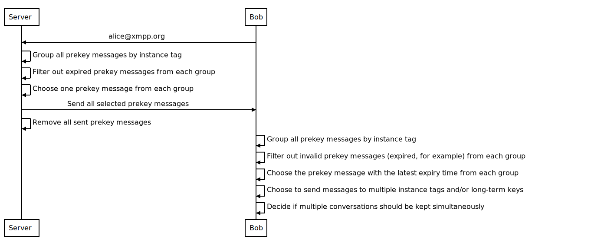
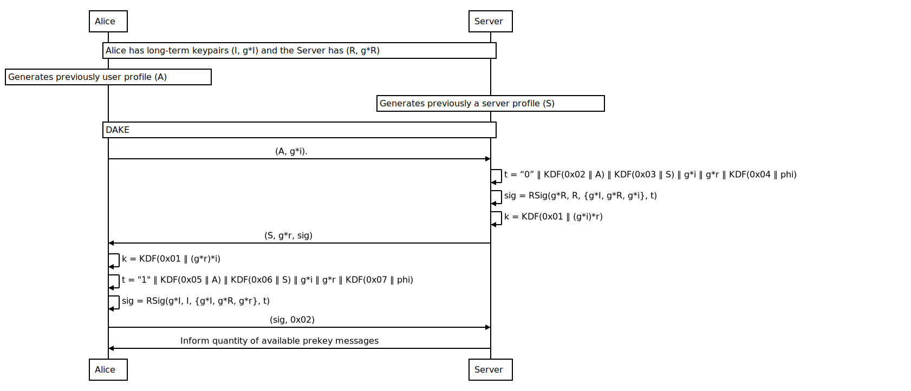

# OTRv4 Prekey Server

```
Disclaimer

This protocol specification is a draft.
```

OTRv4 Prekey Server provides an specification for OTRv4 [\[1\]](#references)
protocol when it needs an untrusted central server to store prekey messages.

## Table of Contents

<!-- TOC depthFrom:1 depthTo:6 withLinks:1 updateOnSave:1 orderedList:0 -->

- [OTRv4 Prekey Server](#otrv4-prekey-server)
    - [Table of Contents](#table-of-contents)
    - [High Level Overview](#high-level-overview)
    - [Assumptions](#assumptions)
    - [Server Specifications](#server-specifications)
    - [Notation and Parameters](#notation-and-parameters)
        - [Notation](#notation)
        - [Elliptic Curve Parameters](#elliptic-curve-parameters)
        - [Key Derivation Functions](#key-derivation-functions)
    - [Data Types](#data-types)
        - [Encoded Messages](#encoded-messages)
        - [Public keys and Fingerprints](#public-keys-and-fingerprints)
        - [Shared Session State](#shared-session-state)
        - [Server's Identifier](#servers-identifier)
    - [Key Management](#key-management)
        - [Shared secrets](#shared-secrets)
        - [Generating Shared Secrets](#generating-shared-secrets)
    - [Interactive DAKE](#interactive-dake)
        - [DAKE-1 Message](#dake-1-message)
        - [DAKE-2 Message](#dake-2-message)
            - [DAKE-3 Message](#dake-3-message)
            - [Prekey Publication Message](#prekey-publication-message)
            - [Storage Information Message](#storage-information-message)
            - [Storage Status Message](#storage-status-message)
        - [State machine](#state-machine)
    - [Publishing Prekey Messages](#publishing-prekey-messages)
    - [Retrieving Prekey Messages](#retrieving-prekey-messages)
    - [Query the server for its storage status](#query-the-server-for-its-storage-status)
    - [A prekey server for OTRv4 over XMPP](#a-prekey-server-for-otrv4-over-xmpp)
        - [Discovering a prekey service](#discovering-a-prekey-service)
        - [Discovering the features supported by a prekey service](#discovering-the-features-supported-by-a-prekey-service)
        - [Publishing prekeys to the service](#publishing-prekeys-to-the-service)
        - [Obtaining information about your prekeys from the service](#obtaining-information-about-your-prekeys-from-the-service)
            - [Retrieving published prekeys from a prekey service](#retrieving-published-prekeys-from-a-prekey-service)
    - [Detailed example of the prekey server over XMPP](#detailed-example-of-the-prekey-server-over-xmpp)
    - [Attacks](#attacks)
        - [KCI attacks and the unstrusted prekey server](#kci-attacks-and-the-unstrusted-prekey-server)
    - [References](#references)

<!-- /TOC -->

## High Level Overview

The OTRv4 Prekey Server specification defines a way by which parties can
publish, store and retrieve prekey messages. A Prekey message contains the
publisher's User Profile, the publisher's Prekey Profile and two one-time use
ephemeral public prekey values, as defined in the OTRv4 specification
[\[1\]](#references). They are used for offline conversations.

In order to perform offline conversations, OTRv4 specification defines a
non-interactive DAKE (manly, XZDH). This DAKE begins when a party that wants to
initiate an offline conversation asks an untrusted prekey server for prekey
messages. These prekey messages have previously been stored in the prekey server
by another party.

This document aims to describe how the prekey server can be used to securely
publish, store and retrieve prekey messages.

## Assumptions

// TODO: are there more assumptions?

OTRv4 Prekey Server specification does not fully protect against an active
attacker performing Denial of Service attacks.

## Server Specifications

The server should be considered untrusted. This means that a malicious server
could cause communication between parties to fail (e.g. by refusing to deliver
prekey messages).

The server must have three capabilities:

- Receive prekey messages and store them.
- Deliver prekey messages previously stored.
- Inform the publisher about how many prekey messages are stored for them.

The server expects to only receive messages on the same network authenticated
clients use to exchange messages, that is, if a message is received from the
network the sender is believed to be authenticated by the network.

Note that prekey submissions (publishing) have to be authenticated. If they are
not authenticated, then malicious users can perform denial-of-service attacks.
To preserve the deniability of the overall OTRv4 protocol, prekeys messages
should never be digitally signed. The best approach is to authenticate prekey
message uploads using a DAKEZ exchange between the published and the server,
which preserves deniability.

// TODO: should in this case the server return a "No-Prekey messages response"?

When this untrusted server runs out of prekey messages, OTRv4 protocol expects
client implementations to wait until a prekey message can be transmitted before
starting a non-interactive DAKE.

By waiting for the server to send prekey messages, OTRv4 will be subject to DoS
attacks when a server is compromised or the network is undermined to return a
"no prekey message available" response from the server.

## Notation and Parameters

### Notation

OTRv4 Prekey Server specification uses the same notation as the OTRv4
specification, defined in the section "Notation" [\[1\]](#references).

Notice that scalars and secret/private keys are in lower case, such as `x`
or `y`. Points and public keys are in upper case, such as `P` or `Q`.

The concatenation of byte sequences `I` and `J` is `I || J`. In this case, `I`
and `J` represent a fixed-length byte sequence encoding of the respective
values.

### Elliptic Curve Parameters

The OTRv4 Prekey Server specification uses the Ed448-Goldilocks
[\[4\]](#references) elliptic curve [\[5\]](#references), with the same
parameters as those defined in the "Elliptic Curve Parameters" of the OTRv4
specification [\[1\]](#references).

### Key Derivation Functions

The following key derivation function is used in this specification:

```
  KDF(usageID || values, size) = SHAKE-256("OTRv4" || usageID || values, size)
```

The `size` first bytes of the SHAKE-256 output for input
`"OTRv4-Prekey-Server" || usageID || values` are returned.

Unlike SHAKE standard, notice that the output size here is defined in bytes.

## Data Types

OTRv4 Prekey Server Specification uses many of the data types already specified
in the OTRv4 specification, as defined in section "Data Types".

OTRv4 Prekey Server Specification also uses the following data type:

```
Prekey Server's Identifier (PREKEY-SERVER-ID):
  Detailed in "Server's Identifier" section
```
### Encoded Messages

OTRv4 Prekey Server messages must be base-64 encoded. To transmit one of these
messages, construct an ASCII string: the six bytes "?OTRP:", the base-64
encoding of the binary form of the message and the byte ".".

### Public keys and Fingerprints

OTR users have long-lived public keys that they use for authentication (but not 
for encryption). The untrusted prekey server has one as well. The are generated
as defined in the "Public keys, Shared Prekeys and Fingerprints" section of the
OTRv4 specification.

Public keys have fingerprints, which are hex strings that serve as identifiers
for the public key. The full OTRv4 fingerprint is calculated by taking the
SHAKE-256 hash of the byte-level representation of the public key. The long-term
public keys for the prekey server have fingerprints as well. The fingerprint is
generated as:

* The first 56 bytes from the `KDF(0x00 || byte(H), 56)` (224-bit security
  level).

### Shared Session State

A Shared Session State is needed for this specification for the same reasons
stated on the "Shared Session State" section of the OTRv4 specification
[\[1\]](#references) (mainly, to authenticate contexts to prevent attacks that
rebind the DAKE transcript into different contexts). It is only needed for
the interactive DAKE between the untrusted prekey server and the publishing
party.

In the case that this interactive DAKE happens over XMPP, this must be:


```
  phi = publisher's bare JID || servers's bare JID
```

For example:

```
  phi = "alice@jabber.net" || "prekeys.xmpp.org"
```

### Server's Identifier

For the interactive DAKE performed by a party and the untrusted server, an
identifier is needed. In the case of the untrusted sever, this value will be
denoted as "Server Identifier".

In any case, it should be hash of the username concatenated with its
long-term public key's fingerprint.

```
Server's Indentifier (PREKEY-SERVER-ID):
  Server's username (DATA)
  Fingerprint (DATA)
```

For a prekey server that uses XMPP, this must be the prekey server's bare JID
(for example, prekey.xmpp.org) and its fingerprint:

```
  server's identifier = "prekey.xmpp.org" || "8625CE01F8D06586DC5B58BB1DC7D9C74F42FB07"
```

## Key Management

In the interactive DAKE between the publisher and the prekey server, long-term
Ed448 keys and ephemeral Elliptic Curve Diffie-Hellman (ECDH) keys are used.
Notice that if this DAKE is only used for deniable authentication, the shared
secret derived during the DAKE should be discarded. Nevertheless, this shared
secret can be used with the Double Ratchet Algorithm to either encrypt the
channel or by untrusted prekey server to encrypt the stored prekey messages
(note that it must handle them out decrypted to the retrieving party).

### Shared secrets

// TODO: change these names

```
  K_ecdh:
    The serialized ECDH shared secret computed from an ECDH exchange, serialized
    as a 'POINT'.
  K:
    The Shared secret is the final shared secret derived from both the ECDH
    shared secret: 'KDF(0x01 || K_ecdh)'.
```

### Generating Shared Secrets

```
  ECDH(a, B)
    B * cofactor
    K_ecdh = a * B
    if K_ecdh == 0 (check that it is an all-zero value)
       return error
    else
       return K_ecdh
```

Check, without leaking extra information about the value of `K_ecdh`, whether
`K_ecdh` is the all-zero value and abort if so, as this process involves
contributory behavior. Contributory behaviour means that both parties' private
keys contribute to the resulting shared key. Since Ed448 have a cofactor of 4,
an input point of small order will eliminate any contribution from the other
party's private key. This situation can be detected by checking for the
all-zero output.

## Interactive DAKE

As previously stated, prekey submissions (publishing) have to be authenticated.
If they are not authenticated, then malicious users can perform
denial-of-service attacks. To preserve the deniability of the overall OTRv4
protocol, they are authenticated using a DAKEZ [\[3\]](#references) exchange
between the publisher and the server, which preserves deniability.

The following parameters are expected to be generated beforehand:

* `(sk_a, Ha)`: Alice's long-term keypair. See: OTRv4, section
   "Public keys, Shared Prekeyes and Fingerprints".
* `(sk_s, Hs)`: Server's long-term keypair. See: OTRv4, section
   "Public keys, Shared Prekeyes and Fingerprints".
* `Alices_User_Profile`: Alice's User Profile. See: OTRv4, section "Creating a
   User Profile".
* `Servers_Identifier`: the Server's identifier.

Alice is also expected to receive beforehand the server's identity and its
long-term public key, so they can be manually verified by her.

Alice will be initiating the DAKEZ with the server:

**Alice**

1. Generates a DAKE-1 message, as defined in [DAKE-1 Message](#dake-1-message)
   section.
1. Sends the DAKE-1 message to the Prekey Server.

**Prekey Server**

1. Receives a DAKE-1 message from Alice:
    * Verifies the DAKE-1 message as defined in the
      [DAKE-1 message](#dake-1-message) section. If the verification fails
      (for example, if Alice's public key -`I`- is not valid), rejects
      the message and does not send anything further.
1. Generates a DAKE-2 message, as defined in
   [DAKE-2 Message](#dake-2-message) section.
1. Calculates the Shared secret (`K`):
   * `K = KDF(0x01 ∥ ECDH(s, I))`.
   * Securely erases `s`.
1. Sends Alice the DAKE-2 message (see [DAKE-2 Message](#dake-2-message)
   section).

**Alice**

1. Receives the DAKE-2 message from the Prekey Server.
1. Retrieves the ephemeral public keys from the Prekey Server (encoded in the
   DAKE-2 message):
    * Validates that the received ECDH ephemeral public key `S` is on curve
      Ed448. See OTRv4 spec, section "Verifying that a point is on the curve"
      section for details.
1. Verifies the DAKE-2 message as defined in the
   [DAKE-2 message](#dake-2-message) section.
1. Creates a DAKE-3 message (see [DAKE-3 Message](#dake-3-message) section).
1. Calculates the Shared secret (`K`):
   * `K = KDF(0x01 ∥ ECDH(i, S))`.
   * Securely erases `i`.
1. Calculates the Prekey MAC key `prekey_mac_k = KDF(0x08 || K, 64)`.
1. Creates the message (`msg`) you want to send to the server.
   1. If you want to publish prekey messages, create a "Prekey publication
      message", as defined in its [section](#prekey-publication-message).
   1. If you want to retrieve storage information, create a "Storage information
      request message", as defined in its
      [section](#storage-information-message).
1. Securely deletes the Prekey MAC key.
1. Attaches the corresponding `msg` to the DAKE-3 message, and sends it.

**Prekey Server**

1. Receives the DAKE-3 message from Alice:
   * Verifies the DAKE-3 message as defined in the
     [DAKE-3 message](#dake-3-message) section. If something fails, abort the
     DAKE and send a failure message.
1. Retrieves the `msg` attached to the DAKE-3 message:
   1. If this is a "Prekey publication message":
      * Calculates the Prekey MAC key `prekey_mac_k = KDF(0x08 || K, 64)`.
      * Computes the Prekey MAC: `KDF(0x09 ∥ prekey_mac_k || message id || N ||
        prekeys, 64)`. Checks that it is equal from the one received in the
        Prekey publication message. If they are not abort the DAKE and send a
        failure message.
      * Checks that `N` corresponds to the number of concatenated prekey
        messages.
      * Stores each prekey message.
   1. If this is a "Storage information request message":
      * Responds with a "Storage Status Message", as defined in its
        [section](#storage-status-message).

### DAKE-1 Message

This is the first message of the DAKE. It is sent to commit to a choice of ECDH
key.

A valid DAKE-1 message is generated as follows:

1. Generate an ephemeral ECDH key pair, as defined in
   the "Generating ECDH and DH keys" of the OTRv4 specification (ignore the
   generation of DH keys from this section):
   * secret key `i` (57 bytes).
   * public key `I`.
2. Generate a 4-byte instance tag to use as the sender's instance tag.
   Additional messages in this conversation will continue to use this tag as the
   sender's instance tag. Also, this tag is used to filter future received
   messages. Messages intended for this instance of the client will have this
   number as the receiver's instance tag.
3. Concatenate the User Profile previously generated.

To verify a DAKE-1 message:

1. Validate the User Profile, as defined in
   "Validating a User Profile" section of the OTRv4 specification.
2. Verify that the point `I` received is on curve Ed448. See
   "Verifying that a point is on the curve" section of the OTRv4 specification.

An DAKE-1 message is an OTRv4 Prekey Server message encoded as:

```
Message type (BYTE)
  The message has type 0x01.

Sender's instance tag (INT)
  The instance tag of the person sending this message.

Receiver's instance tag (INT)
  The instance tag of the intended recipient. As the instance tag is used to
  differentiate the clients that a participant uses, this will often be 0 since
  the other party may not have set its instance tag yet.

Sender's User Profile (USER-PROF)
  As described in the section "Creating a User Profile" of the OTRv4
  specification.

I (POINT)
  The ephemeral public ECDH key.

```

### DAKE-2 Message

This is the second message of the DAKEZ. It is sent to commit to a choice of a
ECDH ephemeral key, and to acknowledge the publisher's ECDH ephemeral key.
This acknowledgment includes a validation that the publisher's ECDH key is on
curve Ed448.

A valid Auth-R message is generated as follows:

1. Generate an ephemeral ECDH key pair, as defined in
   the "Generating ECDH and DH keys" of the OTRv4 specification (ignore the
   generation of DH keys from this section):
   * secret key `s` (57 bytes).
   * public key `S`.
2. Compute
   `t = 0x00 || KDF(0x02 || Alices_User_Profile, 64) ||
    KDF(0x03 || Servers_Identifier, 64) || I || S || KDF(0x04 || phi, 64)`.
   `phi` is the shared session state as mention in its
   [section](#shared-session-state). `Servers_Identifier` is the server's
   identifier as mention in its [section](#servers-identifier).
3. Compute `sigma = RSig(H_s, sk_hs, {H_a, H_s, I}, t)`. See: OTRv4 section
   "Ring Signature Authentication".
4. Generate a 4-byte instance tag to use as the sender's instance tag.
   Additional messages in this conversation will continue to use this tag as the
   sender's instance tag. Also, this tag is used to filter future received
   messages. For the other party, this will be the receiver's instance tag.
5. Use the sender's instance tag from the DAKE-1 message as the receiver's
   instance tag.

To verify an DAKE-2 message:

1. Check that the receiver's instance tag matches your sender's instance tag.
4. Validate the Server's Identifier by:
   * Calculate the fingerprint of the Server's long-term public key (`H_s`).
   * Calculate the Server's Identifier and compare with the one received.
   Extract `H_s` from it.
5. Compute `t = 0x00 || KDF(0x02 || Alices_User_Profile, 64) ||
   KDF(0x03 || Servers_Indentifier, 64) || I || S || KDF(0x04 || phi, 64)`.
   `phi` is the shared session state as mention in its
   [section](#shared-session-state). `Servers_Identifier` is the server's
   identifier as mention in its [section](#servers-identifier).
6. Verify the `sigma` with `sigma == RVrf({H_a, H_s, I}, t)`
   See the "Ring Signature Authentication" section from the OTRv4 specification.

A DAKE-2 message is an OTRv4 Prekey Server message encoded as:

```
Message type (BYTE)
  The message has type 0x02.

Sender's instance tag (INT)
  The instance tag of the person sending this message.

Receiver's instance tag (INT)
  The instance tag of the intended recipient.

Server's Identifier (PREKEY-SERVER-ID)
  As described in the section "Server's Identifier".

S (POINT)
  The ephemeral public ECDH key.

sigma (RING-SIG)
  The 'RING-SIG' proof of authentication value.
```

#### DAKE-3 Message

This is the final message of the DAKE. It is sent to verify the authentication
`sigma`.

A valid DAKE-3 message is generated as follows:

1. Compute
   `t = 0x01 || KDF(0x05 || Alices_User_Profile, 64) ||
    KDF(0x06 || Servers_Identifier, 64) || I || S || KDF(0x07 || phi, 64)`.
   `phi` is the shared session state as mention in its
   [section](#shared-session-state). `Servers_Identifier` is the server's
   identifier as mention in its [section](#servers-identifier).
2. Compute `sigma = RSig(H_a, sk_ha, {H_a, H_s, S}, t)`, as defined in
   "Ring Signature Authentication" section of the OTRv4 specification.
3. Continue to use the sender's instance tag.

To verify a DAKE-3 message:

1. Check that the receiver's instance tag matches your sender's instance tag.
2. Compute
   `t = 0x01 || KDF(0x05 || Alices_User_Profile, 64) ||
    KDF(0x06 || Servers_Identifier, 64) || I || S || KDF(0x07 || phi, 64)`.
   `phi` is the shared session state as mention in its
   [section](#shared-session-state). `Servers_Identifier` is the server's
   identifier as mention in its [section](#servers-identifier).
3. Verify the `sigma` with `sig == RVrf({H_s, H_a, S}, t)`. See the
   "Ring Signature Authentication" section on the OTRv4 specification.

A DAKE-3 is an OTRv4 Prekey Server message encoded as:

```
Message type (BYTE)
  The message has type 0x03.

Sender's instance tag (INT)
  The instance tag of the person sending this message.

Receiver's instance tag (INT)
  The instance tag of the intended recipient.

sigma (RING-SIG)
  The 'RING-SIG' proof of authentication value.

Message (DATA)
  The message sent to the prekey server.
  In this protocol there are 2 kinds of messages:
    - Prekey publication
    - Storage information
```

#### Prekey Publication Message

// TODO: should they be sent all at once?, shouldn't the submission be
// one by one and each one of them have a MAC? How is the MAC going to
// actually work?

This is the message you send when you want to store prekey messages in the
server.

A valid Prekey Publication message is generated as follows:

1. Concatenate all the prekey messages. Assign `N` as the number of concatenated
   prekey messages.
2. Calculates the `Prekey MAC`:
   `KDF(0x09 ∥ prekey_mac_k || message id ∥ N ∥ prekeys, 64)`

```
Message ID (BYTE)
  This message has ID 0x04.

N (SHORT)
   The number of prekey messages present in this message.

Prekeys (DATA)
   All (N) prekey messages serialized according to OTRv4 spec.

Prekey MAC (MAC)
   The MAC for this entire message.
```

#### Storage Information Message

This is the message you send when you want to know how many prekey messages are
there in storage. Only the publisher can send this message.

```
Message ID (BYTE)
  This message has ID 0x05.
```

#### Storage Status Message

The storage status message is sent by the Prekey Server in response to a
Storage information request.

It must be encoded as:

```
Message type (BYTE)
  The message has type 0x06.

Sender's instance tag (INT)
  The instance tag of the person sending this message.

Receiver's instance tag (INT)
  The instance tag of the intended recipient.

// TODO: is this per long-term key, or per device?

Stored prekey messages (INT)
  The number of prekey messages stored in the prekey server for the
  long-term public key used in the DAKE.
```

### State machine

States:

- IN_DAKE: Client has sent a DAKE-1 message, or Server has sent a DAKE-2 message.
- NOT_IN_DAKE: Not on IN_DAKE state.

**Starting the DAKE**

- Client sends DAKE-1 message.
- Transitions to IN_DAKE.

**Receiving a DAKE-1 message**

- Server sends DAKE-2 message.
- Transitions to IN_DAKE.

**Receiving a DAKE-2 message**

If client is in state IN_DAKE:

- Client sends DAKE-3 message.
- Transitions to NOT_IN_DAKE.

Otherwise:

- Ignore message.

**Receiving a DAKE-3 message**

If server is in state IN_DAKE:

- Transitions to NOT_IN_DAKE.

Otherwise:

- Ignore message.


## Publishing Prekey Messages



// TODO: the server does not perform any check, as far as I know. The server is
untrusted and therefore cannot perform any check. The client that asks for
prekey messages and receives them, is the one that checks.

1. Client creates prekey messages.
   1. Prekey messages are created as defined in OTRv4 spec.
1. Client receives a server identifier (e.g. prekey.autonomia.digital) and the
   server's long-term public key from some source. In XMPP, this happens through
   your server's service discovery.
1. Client authenticates with the server through an interactive DAKE and, by
   that, it deniably authenticates and generates a shared secret.
   See section [Interactive DAKE](#interactive-dake).
1. Client sends prekey messages to the Prekey Server. It should send a prekey
   message for every long term key that belongs to the publisher for this
   device/client.
1. Server verifies the received prekey messages.
   1. Checks the integrity of the prekey messages.
   1. Checks the User Profile (and if it is signed by the same long-term key
      that was used in the DAKE).
   1. Checks the Prekey Profile (and if it is signed by the same long-term key
      that was used in the DAKE and stated in the User Profile).
1. Server stores the prekey messages.
1. Server sends acknowledgment that the operation succeeded.

## Retrieving Prekey Messages

// TODO: here is missing the trust on the long-term public keys.



In order to send an encrypted offline message, a client must obtain a prekey
message:

1. Client informs which identity it wants a Prekey Message for.
1. Server selects one prekey message for each instance tag of the identity.
   1. Group all prekey messages by long-term public key and by instance tag.
   1. Filter out expired prekey messages from each group.
   1. Choose one prekey message from each group.
1. Server delivers all selected prekey messages to the Client.
1. Server removes the selected prekey messages from its storage.
1. Client selects the latest prekey messages form each instance tag.
   1. Group all prekey messages by long-term public key and by instance tag.
   1. Filter out invalid prekey messages (expired, for example) from each group,
      as defined in the "Receiving Prekey Messages" section of the OTRv4
      specification.
   1. Choose the prekey message with the latest expiry time from each group.
1. Client chooses which prekey messages to send an encrypted offline message to:
   1. Inform the user if the message will be send to multiple instance tags
      and/or long-term keys.
   1. Decide if multiple conversations should be kept simultaneously (one per
      instance tag).

## Query the server for its storage status



1. Client uses a DAKEZ to authenticate with the server. See section
   [Interacive DAKE](#interactive-dake).
2. Server responds with a "storage status message" containing the number of
   prekey messages stored for the long-term public key and identity used in the
   DAKEZ.

## A prekey server for OTRv4 over XMPP

A prekey server implementation over XMPP must support Service Discovery
(XEP-0030) ("disco").

### Discovering a prekey service

An entity often discovers a prekey service by sending a Service Discovery items
("disco#items") request to its own server.

```
  <iq from='alice@xmpp.org/notebook'
      id='h7ns81g'
      to='xmpp.org'
      type='get'>
    <query xmlns='http://jabber.org/protocol/disco#items'/>
  </iq>
```

The server then returns the services that are associated with it.

```
  <iq from='xmpp.org'
      id='h7ns81g'
      to='alice@xmpp.org/notebook'
      type='result'>
    <query xmlns='http://jabber.org/protocol/disco#items'>
      <item jid='prekey.xmpp.org'
            name='OTRv4 prekey server'/>
    </query>
  </iq>
```

### Discovering the features supported by a prekey service

An entity may wish to discover if a service implements the prekey server
protocol; in order to do so, it sends a service discovery information
("disco#info") query to the prekey service's JID.

```
  <iq from='alice@xmpp.org/notebook'
      id='lx09df27'
      to='prekey.xmpp.org'
      type='get'>
    <query xmlns='http://jabber.org/protocol/disco#info'/>
  </iq>
```

The service must return its identity and the features it supports.

```
  <iq from='prekey.xmpp.org'
      id='lx09df27'
      to='alice@xmpp.org/notebook'
      type='result'>
    <query xmlns='http://jabber.org/protocol/disco#info'>
      <identity
          category='otrv4-prekey'
          name='OTRv4 prekey server'
          type='text'/>
      <feature var='http://jabber.org/protocol/otrv4-prekey'/>
    </query>
  </iq>
```

### Publishing prekeys to the service

An entity authenticates to the service through an interactive DAKE. DAKE
messages are send in "message" stanzas.

An entity starts the DAKE by sending the first encoded message in the body
of a message.

```
  <message
      from='alice@xmpp.org/notebook'
      id='nzd143v8'
      to='prekey.xmpp.org'>
    <body>?OTRPEB...</body>
  </message>
```

The service responds with another message.

```
  <message
      from='prekey.xmpp.org'
      id='13fd16378'
      to='alice@xmpp.org/notebook'>
    <body>?OTRPEC...</body>
  </message>
```

And the entity terminates the DAKE and send the prekey messages (DAKE-3 message
has action 0x01):

```
  <message
      from='alice@xmpp.org/notebook'
      id='kud87ghduy'
      to='prekey.xmpp.org'>
    <body>?OTRPED...</body>
  </message>
```

And the server respond with a success message:

// TODO: Should this message also have instance tags?

```
  <message
      from='prekey.xmpp.org'
      id='0kdytsmslkd'
      to='alice@xmpp.org/notebook'>
    <body>?OTRP OK</body>
  </message>
```

### Obtaining information about your prekeys from the service

An entity authenticates to the service through a DAKE. DAKE messages are send
in "message" stanzas.

An entity starts the DAKE by sending the first encoded message in the body
of a message.

```
  <message
      from='alice@xmpp.org/notebook'
      id='nzd143v8'
      to='prekey.xmpp.org'>
    <body>?OTRPEB...</body>
  </message>
```

The service responds with another message.

```
  <message
      from='prekey.xmpp.org'
      id='13fd16378'
      to='alice@xmpp.org/notebook'>
    <body>?OTRPEC...</body>
  </message>
```

And the entity terminates the DAKE and asks for storage information
(DAKE-3 message has action 0x02):

```
  <message
      from='alice@xmpp.org/notebook'
      id='kud87ghduy'
      to='prekey.xmpp.org'>
    <body>?OTRPED...</body>
  </message>
```

And the server respond with a storage status message:

```
  <message
      from='prekey.xmpp.org'
      id='0kdytsmslkd'
      to='alice@xmpp.org/notebook'>
    <body>?OTRPEE...</body>
  </message>
```

#### Retrieving published prekeys from a prekey service

An entity asks the service for prekey messages from a particular subject,
for example, "bob@xmpp.net".

```
  <message
      from='alice@xmpp.org/notebook'
      id='nzd143v8'
      to='prekey.xmpp.org'>
    <subject>bob@xmpp.net</subject>
  </message>
```

The service responds with a Prekey Publication message, this time not inside
a DAKE-3 message and without a MAC field.

```
  <message
      from='prekey.xmpp.org'
      id='13fd16378'
      to='alice@xmpp.org/notebook'>
    <body>?OTRP...</body>
  </message>
```

## Detailed example of the prekey server over XMPP

bob@xmpp.org wants to know how many prekeys remain unused on the server

1. bob@xmpp.org logs in to his server (talk.xmpp.org).
1. bob@xmpp.org uses service discovery to find a prekey server on his server
   (prekey.xmpp.org).
   1. The service discovery also informs the prekey server's long-term public
      key.
1. bob@xmpp.org discovers the capabilities of prekey.xmpp.org.
   1. prekey.xmpp.org is capable of all features of a prekey server.
1. bob@xmpp.org asks prekey.xmpp.org about the number of prekeys it has stored
   for him.
   1. TODO: Explain the DAKE.

bob@xmpp.org wants to publish prekey messages

1. bob@xmpp.org logs to his server (talk.xmpp.org).
1. bob@xmpp.org uses service discovery to find a prekey server on his server
   (prekey.xmpp.org).
   1. The service discovery also informs the prekey server's long-term public
      key.
1. bob@xmpp.org discovers the capabilities of prekey.xmpp.org.
   1. prekey.xmpp.org is capable of all features of a prekey server.
1. bob@xmpp.org generates 3 prekeys:
   1. prekey1: instance tag 90
   1. prekey2: instance tag 90
   1. prekey3: instance tag 90
1. bob@xmpp.org sends DAKE-msg1 to prekey.xmpp.org.
   1. TODO: details of how ephemeral keys will be generated.
1. bob@xmpp.org receives DAKE-msg2 from prekey.xmpp.org/123980831. (The resource
   identifies this DAKE).
   1. TODO: details of how ephemeral keys will be generated.
   1. bob@xmpp.org verifies prekey.xmpp.org long-term public key.
1. bob@xmpp.org sends DAKE-msg3 to prekey.xmpp.org/123980831.
   1. TODO: details of how to attach prekeys to the DAKE-msg3.
   1. DAKE-msg3 also contains prekey1, prekey2, prekey3.
1. bob@xmpp.org receives a SUCCESS/FAILURE msg from prekey.xmpp.org/123980831.

alice@jabber.org wants to send an offline message to bob@xmpp.org

1. alice@jabber.org logs to his server (xmpp.jabber.org).
1. alice@jabber.org uses service discovery to find a prekey server on bob's
   server (prekey.xmpp.org).
   1. The service discovery also informs the prekey server's long-term public
      key.
1. alice@jabber.org discovers the capabilities of prekey.xmpp.org.
   1. prekey.xmpp.org is capable of all features of a prekey server.
1. alice@jabber.org asks prekey.xmpp.org for prekeys from bob@xmpp.org.
1. prekey.xmpp.org delivers 3 prekeys to her:
   1. Server has the following prekey messages stored for bob@xmpp.org
      1. prekey1: instance tag 90. Expired.
      1. prekey2: instance tag 90. Not expired.
      1. prekey3: instance tag 91. Not expired.
      1. prekey4: instance tag 91. Not expired.
   1. Server chooses to deliver the following instance tags to alice@jabber.org
      1. prekey2: instance tag 90. Not expired.
      1. prekey3: instance tag 91. Not expired.
1. alice@jabber.org choses which prekey messages to use.
   1. Validate received prekey messages.
      1. The received prekey messages are not expired.
      1. The received prekey messages are from different instance tags, no need
         to choose by latest expiration time.
   1. Client asks the user if they want to send one message to each instance tag.
      1. If user says: "yes", send one message to each instance tag.
      1. If user says: "no", send one message to the instance tag chosen by the user.
1. alice@jabber.org sends an offline encrypted message to bob@xmpp.org.

## Attacks

// TODO: check the attacks: replay, key reused, attacker modifies prekey or
format?

- What if the server delivers all the prekey messages to an adversary
- How does forward secrecy is compromised when the prekey server refuses to hand
  out prekey messages?

### KCI attacks and the unstrusted prekey server

The security of Non-Interactive DAKE (XZDH) in OTRv4 specification does not
require trusting the central server used to distribute prekeys messages.
However, if we allow a scenario in which the user’s keys have been compromised
but the central prekey server has not, then we can achieve better plausible
deniability. The user may ask the central server in advance to assist with a
forged conversation, casting doubt on all conversations conducted by the judge
using the compromised device.

## References

1. https://github.com/otrv4/otrv4/blob/master/otrv4.md
2. https://github.com/otrv4/otrv4/blob/master/otrv4.md#validating-prekey-messages
3. Goldberg, I. and Unger, N. (2016). Improved Strongly Deniable Authenticated
   Key Exchanges for Secure Messaging, Waterloo, Canada: University of Waterloo.
   Available at: http://cacr.uwaterloo.ca/techreports/2016/cacr2016-06.pdf
4. Hamburg, M. (2015). *Ed448-Goldilocks, a new elliptic curve*, NIST ECC
   workshop. Available at: https://eprint.iacr.org/2015/625.pdf
5. Hamburg, M., Langley, A. and Turner, S. (2016). *Elliptic Curves for
   Security*, Internet Engineering Task Force, RFC 7748. Available at:
   http://www.ietf.org/rfc/rfc7748.txt
